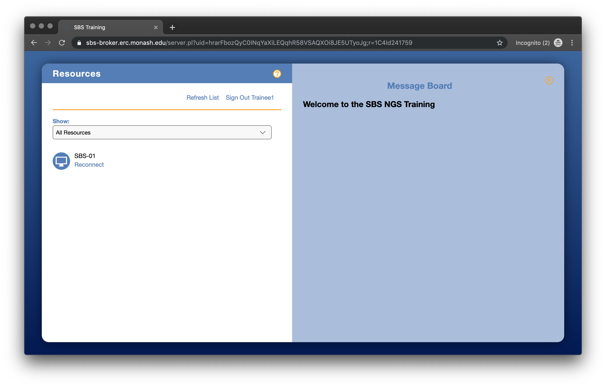

# Welcome to the Introduction to NGS Workshop (30 Sep - 4 Oct 2019)
 

## How to login to training VM

The login URL/site is below:
https://sbs-broker.erc.monash.edu/
(Note this site is currently accessible only within Monash network).

Loading this URL in any browser will display the main/login page:

 

**Figure 1:** VM login screen

There are is an invidiual training VM instance created for you. These are numbered as (SBS-01/02/03), and training accounts
have been 1 instance each. The training accounts are below:

Training accounts usernames are provided to you.

Password: *1H3d%#X

Upon login to the URL/site above, the assigned instance is shown:

Click on the *Reconnect* link to then connect to the instance's remote desktop (via HTML5 viewer).
The instance's desktop environment is then displayed:

Training modules (e.g qc, cli) contain datasets required for each module. There is precomputed data for some of the section, please DO NOT DELETE.

 
Terminal/shell is available from the bottom tools bar:

## How to transfer data in and out of the VM

For transferring files in/out of the training environment, users can use "scp" (or WinSCP for Windows).

For example, if user (trainee1) is logged into sbs-01.erc.monash.edu, user can scp files in/out of the training instance via:

     scp trainee1@sbs-01.erc.monash.edu

Using the password provided in the https://tsonika.github.io/NGS-SBS-Monash2019/login/login/ section of the manual.

## Acknowledgements

The training VMs have been kindly provided by the Monash eResearch platform at the Monash University. Mr Jerico Revote has provided his technical expertise in setting those up.
